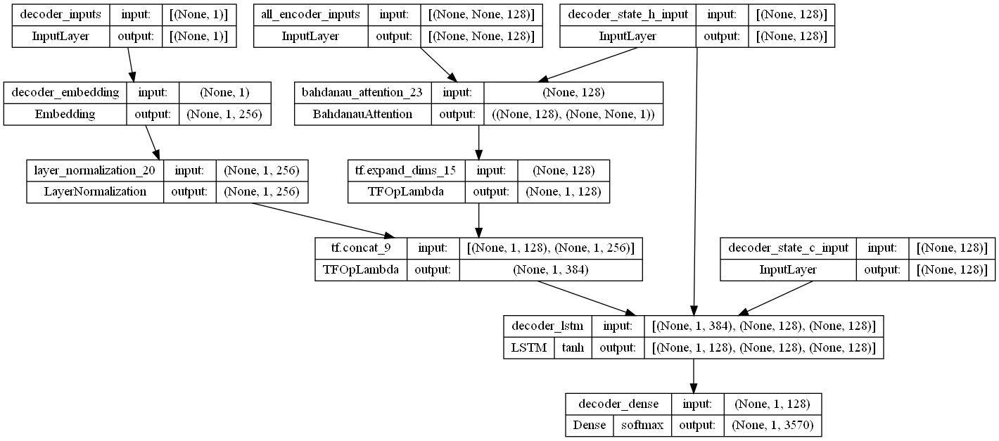

# AI Chatbot

gif here

Dataset is available inside the repository

## Introduction

These days as you can see that Chatbots are in high trend when it comes to Artificial Intelligence. As most of the organizations have already started implementing chatbots on their sites especially on e-commerce websites. 
To build a chatbot using NLP/Deep Learning takes a lot of time to build a chatbot easily but the only problem is that you need to feed as many data as you can for the bot to learn and here data doesn't just mean the questions and its category but also the question pattern.

## Chatbot Dataset Details

I tried to find the simple datasets for a chat bot (seq2seq). Then I decided to compose it myself. It is based on a website with simple dialogues for beginners.
First column is questions, second is answers.

## Model

[alt text](architecture/encoder.png)

## Getting started

Feel free to use the model and your own dataset.

If you want to run the application locally use following steps -

- git clone `https://github.com/darthdaenerys/AI-Chatbot.git`
- Navigate to the project directory: `cd AI-Chatbot`
- Install Python dependencies: `pip install -r requirements.txt`
- Move to backend directory `cd backend`
- Install Node.js dependencies(open another terminal): `npm install`
- Start the server: `node index.js`
- Open another terminal from the project directory
- Install react dependencies `npm install`
- `npm start` Runs the app in the development mode.
- Open [http://localhost:3000]() to view it in your browser.

## Contributing

If you would like to contribute to this project, you can fork the repository and submit a pull request with your changes. Please make sure to test your changes thoroughly before submitting the pull request.

Thanks for visiting!